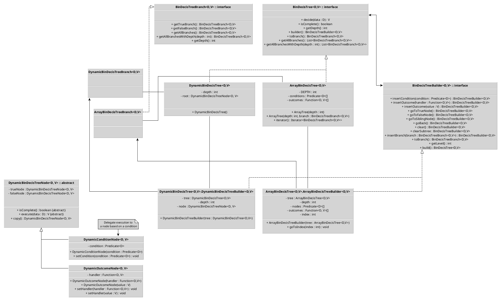

# Classes
## CBDTreeNode
The base class for nodes (vertices) of binary tree. It has the level (integer) (e.g. level = 0 means that it is root of tree). 

## UML diagram

# Prototype of usage 
```java
BDTree<int, int> machine = DynamicBDTree<>();
BDTreeBuilder<int, int> builder = machine.builder();
builder.insertCondition(a -> a > 10);
builder.goToTrueBranch();
builder.insertOutcome(1);
builder.goBack();
builder.goToFalseBranch();
builder.insertCondition(a -> a < 5);
builder.goToTrueBranch();
builder.insertOutcome(2);
builder.goBack();
builder.goToFalseBranch();
builder.insertOutcome(3);
int depth = machine.getDepth();
int result = machine.decide(9);

// ===================================== //

BDTree<int, int> machine = ArrayBDTree<>(2);
BDTreeBuilder<int, int> builder = machine.builder();
builder.insertCondition(a -> a > 10);
builder.goToTrueBranch();
builder.insertOutcome(1);
builder.goBack();
builder.goToFalseBranch();
builder.insertCondition(a -> a < 5);
builder.goToTrueBranch();
builder.insertOutcome(2);
builder.goBack();
builder.goToFalseBranch();
builder.insertOutcome(3);
int depth = machine.getDepth();
int result = machine.decide(9);

// ===================================== //

BDTree<int, int> casino = new ArrayBDTree<>();
BDTreeBuilder<> builder = validator.builder();
builder.insertOutcome(a -> {
	Random random = new Random();
	if (Math.random() > 0.5) {
		a*=2;
	} else {
		a=0;
	}
	return a;
})

// ===================================== //

BDTree<int, int> casino = new ArrayBDTree<>();
BDTreeBuilder<> builder = validator.builder();
builder.insertCondition(a -> {
	Random random = new Random();
	if (Math.random() > 0.5) {
		a*=2;
		return true;
	}
	return false;
})
builder.goToTrueBranch();
builder.insertOutcome(a -> {
	Random random = new Random();
	if (Math.random() > 0.5) {
		a*=2;
	} else {
		a=0;
	}
	return a;
})
builder.goBack();
builder.goToFalseBranch();
builder.insertOutcome(0);

// ===================================== //

interface User {
	public int getAge();
	public int getBalance();
}

enum AdvertisementType {
	GENERAL,
	RICH,
	CHILD
}

BDTree<User, AdvertisementTypeA> tree = new DynamicBDTree<>();
BDTreeBuilder<> builder = tree.builder();
builder.insertCondition(user -> {
	return user.getAge() > 18;
});
builder.goToTrueBranch();
builder.insertCondition(user -> {
	return user.getBalance() > 10000;
});
builder.goToTrueBranch();
builder.insertOutcome(AdvertisementType.RICH);
builder.goBack();
builder.goToFalseBranch();
builder.insertOutcome(AdvertisementType.GENERAL);
builder.goBack();
builder.goBack();
builder.goToFalseBranch();
builder.insertOutcome(AdvertisementType.CHILD);
```

# Notes
- rename library to BinDecisTree (bindecistree)

Prototype of nodes 
```java
abstract class Node<D, V> {
    public abstract V execute(D data);
}

class CNode<D, V> extends Node<D, V> {
    private Predicate<D> condition;
    private Node<D, V> trueBranch;
    private Node<D, V> falseBranch;

    public CNode(Predicate<D> condition, Node<D, V> trueBranch, Node<D, V> falseBranch) {
        this.condition = condition;
        this.trueBranch = trueBranch;
        this.falseBranch = falseBranch;
    }

    @Override
    public V execute(D data) {
        // check for nulls and other errors
        if (condition.test(data)) {
            return trueBranch.execute(data);
        } else {
            return falseBranch.execute(data);
        }
    }
}

class ONode<D, V> extends Node<D, V> {
    private V value;

    public ONode(V value) {
        this.value = value;
    }

    @Override
    public V execute(D data) {
        return value;
    }
}
```
