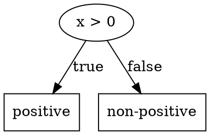

# Proposed Enhancements

This document lists recommended improvements and new features for the Binary Decision Tree library.

## Priority Legend

| Priority | Description | Timeline |
|----------|-------------|----------|
| 🔴 Critical | Must have, blocks other work | Immediate |
| 🟠 High | Should have, significant value | Next sprint |
| 🟡 Medium | Nice to have, moderate value | Future release |
| 🟢 Low | Optional, minor value | Backlog |

---

## Core Improvements

### 1. Add Parent Reference to Nodes 🔴

**Current Issue:**
```java
// O(n) parent lookup
private AbstractDecisionNode<I, O> findParent(root, child) {
    // Traverses entire tree in worst case
}
```

**Proposed Solution:**
```java
abstract class AbstractDecisionNode<I, O> {
    private AbstractDecisionNode<I, O> parent;  // NEW
    
    public AbstractDecisionNode<I, O> getParent() {
        return parent;
    }
    
    void setParent(AbstractDecisionNode<I, O> parent) {
        this.parent = parent;
    }
}
```

**Impact:**
- `goToParent()`: O(n) → O(1)
- `goToSibling()`: O(n) → O(1)
- `insertCondition()`: O(n) → O(1)
- Memory: +4 bytes per node

**Files to Modify:**
- `AbstractDecisionNode.java`
- `DynamicDecisionTree.java` (Builder methods)
- `ConditionNode.java` (copy constructor)

---

### 2. Fix Builder Copy Semantics 🔴

**Current Issue:**
```java
public Builder(DynamicDecisionTree<I, O> tree) {
    this.tree = tree;
    this.currentNode = tree.root.copy();  // Copies entire tree immediately!
}
```

**Proposed Solution:**
```java
public Builder(DynamicDecisionTree<I, O> tree) {
    this.tree = tree;
    this.currentNode = tree.root;  // Reference only
    this.modified = false;
}

@Override
public BinaryDecisionTree<I, O> build() {
    if (modified) {
        tree.root = tree.root.copy();  // Copy only on build
    }
    // ... validation
    return tree;
}
```

**Benefits:**
- Faster builder creation
- Reduced memory pressure
- More intuitive behavior

---

### 3. Implement ArrayDecisionTree 🟠

**Status:** Design complete, implementation pending

**See:** [ArrayDecisionTree Specification](array-decision-tree.md)

**Benefits:**
- O(1) navigation operations
- Better cache locality
- ~60% memory reduction for dense trees

**Implementation Order:**
1. Core class structure with arrays
2. Navigation methods (goTo*)
3. Modification methods (insert*)
4. Build and validation
5. ArrayDecisionBranch

---

### 4. Add Visitor Pattern 🟠

**Purpose:** Separate algorithms from tree structure

**Interface:**
```java
public interface DecisionTreeVisitor<I, O> {
    void visit(ConditionNode<I, O> node, int depth);
    void visit(OutcomeNode<I, O> node, int depth);
    default void startTree() {}
    default void endTree() {}
}
```

**Usage in Nodes:**
```java
abstract class AbstractDecisionNode<I, O> {
    public abstract void accept(DecisionTreeVisitor<I, O> visitor, int depth);
}

class ConditionNode<I, O> extends AbstractDecisionNode<I, O> {
    @Override
    public void accept(DecisionTreeVisitor<I, O> visitor, int depth) {
        visitor.visit(this, depth);
        if (getTrueChild() != null) 
            getTrueChild().accept(visitor, depth + 1);
        if (getFalseChild() != null) 
            getFalseChild().accept(visitor, depth + 1);
    }
}
```

**Example Visitors:**
- `DotVisitor` - Export to GraphViz
- `ValidationVisitor` - Collect errors
- `StatisticsVisitor` - Count nodes, measure depth
- `SerializationVisitor` - JSON/XML output

---

### 5. Add Tree Serialization 🟠

**JSON Format:**
```json
{
  "type": "condition",
  "condition": "x > 0",
  "trueChild": {
    "type": "outcome",
    "outcome": "positive"
  },
  "falseChild": {
    "type": "outcome",
    "outcome": "non-positive"
  }
}
```

**API:**
```java
public interface BinaryDecisionTree<I, O> {
    // NEW methods
    String toJson();
    static <I, O> BinaryDecisionTree<I, O> fromJson(String json, Class<I> inputClass, Class<O> outputClass);
    
    String toXml();
    static <I, O> BinaryDecisionTree<I, O> fromXml(String xml, Class<I> inputClass, Class<O> outputClass);
}
```

---

### 6. Add Tree Visualization 🟠

**DOT/GraphViz Export:**
```java
public interface BinaryDecisionTree<I, O> {
    String toDot();
    
    default void exportToPng(File output) {
        String dot = toDot();
        // Execute dot command
        Runtime.getRuntime().exec("dot -Tpng -o " + output + " < " + dot);
    }
}
```

**Output:**


---

## Builder Enhancements

### 7. Add Path Tracing 🟡

**Purpose:** Debug decision paths

**API:**
```java
public class DecisionPath<I, O> {
    private final List<PathStep<I, O>> steps = new ArrayList<>();
    
    public record PathStep<I, O>(
        int depth,
        Predicate<I> condition,
        boolean result,
        O outcome  // null if not leaf
    ) {}
    
    @Override
    public String toString() {
        // "x > 0 (true) → x < 10 (false) → outcome: medium"
    }
}

public interface BinaryDecisionTree<I, O> {
    DecisionPath<I, O> tracePath(I input);
}
```

---

### 8. Add Tree Pruning 🟡

**Purpose:** Optimize tree by removing redundant nodes

**Example:**
```
Before:                         After:
    x > 5                           x > 5
   /     \                         /     \
  x > 3   "high"                 "low"  "high"
 /     \
"low"  "low"   ← redundant
```

**API:**
```java
public interface DecisionTreeBuilder<I, O> {
    DecisionTreeBuilder<I, O> prune();
}
```

**Algorithm:**
1. Find condition nodes where both children produce same outcome
2. Replace condition with outcome
3. Recurse up tree

---

### 9. Add Subtree Replacement 🟡

**API:**
```java
public interface DecisionTreeBuilder<I, O> {
    DecisionTreeBuilder<I, O> replaceCurrent(DecisionBranch<I, O> newSubtree);
    DecisionTreeBuilder<I, O> replaceCurrent(Predicate<I> condition);
    DecisionTreeBuilder<I, O> replaceCurrent(O outcome);
}
```

---

## API Improvements

### 10. Add Tree Statistics 🟡

**API:**
```java
public class TreeStatistics {
    private final int nodeCount;
    private final int conditionCount;
    private final int outcomeCount;
    private final int depth;
    private final double balanceFactor;  // leftHeight / rightHeight
    private final Map<Integer, Integer> nodesPerDepth;
    
    // Getters...
}

public interface BinaryDecisionTree<I, O> {
    TreeStatistics getStatistics();
}
```

---

### 11. Add Iterators 🟡

**API:**
```java
public interface BinaryDecisionTree<I, O> {
    // Breadth-first iteration
    Iterable<DecisionBranch<I, O>> breadthFirst();
    
    // Depth-first iteration
    Iterable<DecisionBranch<I, O>> depthFirst();
    
    // Iterate at specific depth
    Iterable<DecisionBranch<I, O>> atDepth(int depth);
}
```

**Usage:**
```java
for (DecisionBranch<Integer, String> branch : tree.breadthFirst()) {
    System.out.println("Node at depth: " + branch.getDepth());
}
```

---

### 12. Add Tree Merging 🟢

**Purpose:** Combine two trees

**API:**
```java
public interface BinaryDecisionTree<I, O> {
    // Merge with AND logic (both must agree)
    BinaryDecisionTree<I, O> mergeAnd(BinaryDecisionTree<I, O> other);
    
    // Merge with OR logic (either can decide)
    BinaryDecisionTree<I, O> mergeOr(BinaryDecisionTree<I, O> other);
    
    // Merge with priority (this tree takes precedence)
    BinaryDecisionTree<I, O> mergeWithPriority(BinaryDecisionTree<I, O> other);
}
```

---

## Error Handling

### 13. Add Custom Exception Hierarchy 🟠

**Current:** Generic `IllegalStateException`

**Proposed:**
```java
public class DecisionTreeException extends RuntimeException {
    public DecisionTreeException(String message) { super(message); }
}

public class UnbuiltTreeException extends DecisionTreeException { }
public class NavigationException extends DecisionTreeException { }
public class InvalidTreeStructureException extends DecisionTreeException { }
public class EmptyTreeException extends DecisionTreeException { }
```

**Usage:**
```java
@Override
public O decide(I input) {
    if (!built) {
        throw new UnbuiltTreeException("Tree must be built before deciding");
    }
    // ...
}
```

---

## Testing Improvements

### 14. Add Property-Based Tests 🟡

**Using Quickcheck-style testing:**

```java
@Property
void copyProducesEqualTree(@ForAll BinaryDecisionTree<Integer, Integer> tree) {
    BinaryDecisionTree<Integer, Integer> copy = tree.copy();
    
    for (int i = 0; i < 100; i++) {
        Integer input = random.nextInt();
        assertEquals(tree.decide(input), copy.decide(input));
    }
}

@Property
void depthIsConsistent(@ForAll BinaryDecisionTree<Integer, Integer> tree) {
    int depth1 = tree.getDepth();
    int depth2 = tree.copy().getDepth();
    assertEquals(depth1, depth2);
}
```

---

### 15. Add Performance Benchmarks 🟡

**Using JMH:**

```java
@State(Scope.Benchmark)
public class TreeBenchmarks {
    @Param({"10", "100", "1000"})
    int treeSize;
    
    BinaryDecisionTree<Integer, Integer> tree;
    
    @Setup
    public void setup() {
        tree = buildTreeOfSize(treeSize);
    }
    
    @Benchmark
    public Integer benchmarkDecide() {
        return tree.decide(42);
    }
}
```

---

## Documentation

### 16. Add JavaDoc Coverage 🟠

**Current:** Partial coverage

**Target:** 100% public API coverage

**Priority Classes:**
1. `BinaryDecisionTree` interface
2. `DecisionTreeBuilder` interface
3. `DecisionBranch` interface
4. All public methods

---

### 17. Add Interactive Examples 🟢

**Create:**
- Jupyter notebooks with examples
- Web-based tree visualizer
- Interactive builder tutorial

---

## Implementation Roadmap

### Phase 1 (Immediate - 2 weeks)
- [ ] Add parent reference to nodes
- [ ] Fix builder copy semantics
- [ ] Add custom exceptions

### Phase 2 (Next - 4 weeks)
- [ ] Implement ArrayDecisionTree
- [ ] Add visitor pattern
- [ ] Add tree serialization

### Phase 3 (Future - 6 weeks)
- [ ] Add tree visualization
- [ ] Add path tracing
- [ ] Add tree statistics

### Phase 4 (Backlog)
- [ ] Add tree pruning
- [ ] Add tree merging
- [ ] Add property-based tests
- [ ] Add performance benchmarks

---

## See Also

- [Architecture Overview](../architecture/overview.md)
- [Performance Analysis](../architecture/performance.md)
- [ArrayDecisionTree Spec](array-decision-tree.md)
- [Roadmap](roadmap.md)
